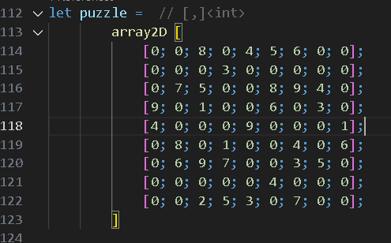
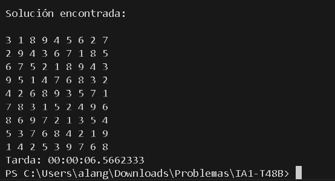
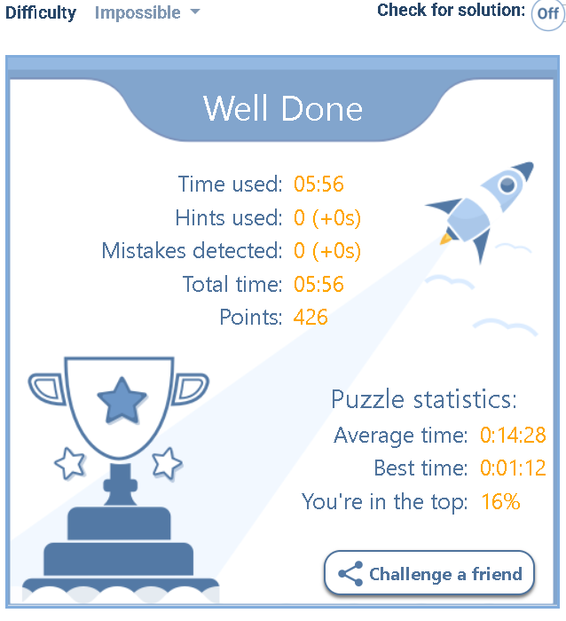

F# Constraint Inference Engine

Este repositorio contiene un motor de resolución de problemas de satisfacción de restricciones (CSP) altamente abstracto y genérico, desarrollado íntegramente en **F#**. El motor separa la definición del problema de la lógica de inferencia, permitiendo resolver desde Sudokus complejos hasta problemas de optimización de recursos.

Arquitectura del Motor
El motor utiliza una combinación de búsqueda sistemática e inferencia lógica para reducir drásticamente el espacio de búsqueda:

AC-3 (Arc Consistency 3): Implementación de consistencia de arcos para la poda de dominios inmutables antes y durante la búsqueda.
Backtracking Informado: Algoritmo de búsqueda profunda integrado con heurísticas de selección de variables:
MRV (Minimum Remaining Values): Elige la variable con el dominio más restringido para maximizar la poda temprana.
Degree Heuristic: Técnica de desempate basada en el grado de restricciones para reducir la incertidumbre futura.
Optimización Local (Mínimos Conflictos): Algoritmo de reparación local con reinicio aleatorio para problemas de gran escala donde el backtracking exhaustivo no es viable.

Casos de Estudio
Sudoku Solver
El motor modela el Sudoku como un CSP con restricciones binarias de fila, columna y caja. 
Rendimiento: Capaz de resolver tableros de nivel "Extremo" (61+ celdas vacías) mediante la propagación de restricciones y búsqueda informada.
Evidencia: Solución validada de tableros complejos en ~30 segundos (enfoque genérico).

N-Queens Problem
Resolución del clásico problema de las N-Reinas utilizando tanto Backtracking como Mínimos Conflictos, demostrando la versatilidad del motor para manejar restricciones espaciales.

**Métrica de Rendimiento:**
Case Study: Solving a Hard Sudoku
Para demostrar la potencia del motor de CSP, se utilizó un tablero con solo 20 pistas (nivel difícil), requiriendo una propagación de restricciones intensiva.

La salida fue correcta en un tiempo de 6s

Stack Técnico
* Paradigma: Programación Funcional Pura (Inmutabilidad, Pattern Matching, Recursión de Cola).
* Lenguaje: F# (.NET Core).
* Estructuras de Datos: Uso intensivo de `Map` (Árboles Rojinegros) para garantizar persistencia y eficiencia en la gestión de estados.